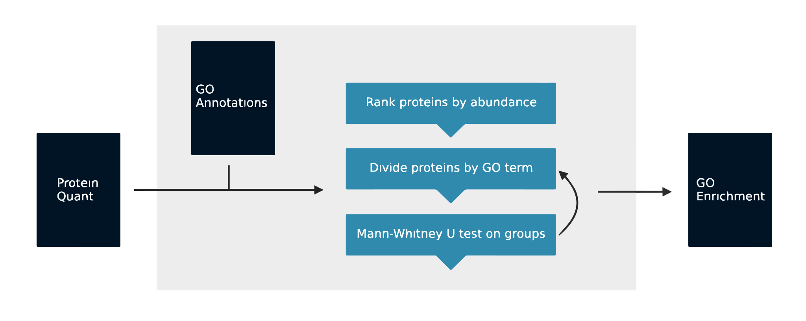
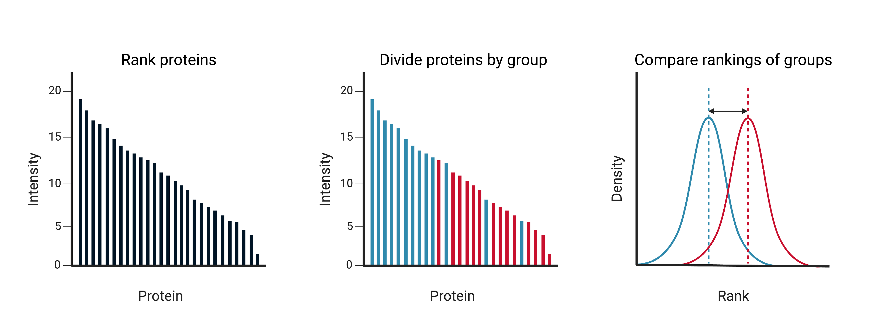

# Gopher: Fast GO Enrichment for Quantitative Proteomic Data

{: style="width:800px"}

Gopher uses a Mann-Whitney U Test to look for enriched gene ontology terms that are present when proteins are ranked by a quantitative value, such as the fold change between two conditions or the abundance of the protein.

{: style="width:800px"}

## Installation

Gopher be pip installed using:

```python
pip install gopher-enrich
```